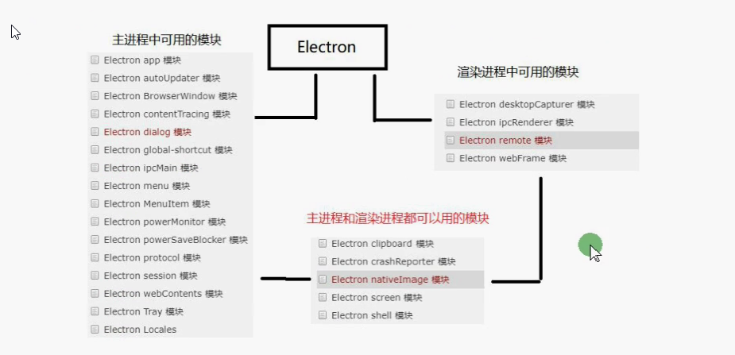
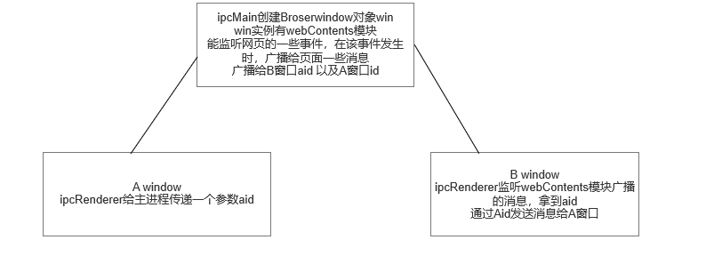
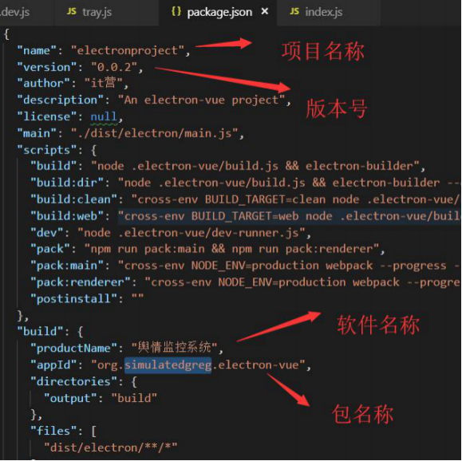
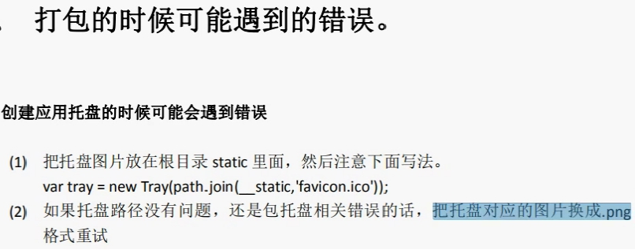

# Electron




## 主进程

+ Electron运行package.json的main脚本的进程称为主进程(后台进程)
  > 主进程中运行的脚本通过创建web页面来展示用户界面
    一个Electron应用总是有且只有一个主进程
    由于Electron使用了Chromiunm(谷歌浏览器)来展示web页面，所以chromium的多进程架构.
    每个Electron中的Web页面运行在它自己的渲染进程中
    主进程使用BrowserWindow实例创建页面,每个BrowserWindow实例都在自己的渲染进程里运行页面，当一个BrowserWindow实列被销毁后，相应的渲染进程也会被终止
+ 普通的浏览器，不被允许去接触原生的资源，而Electron在node.js 的Api支持下可以在页面中和操作系统进行一些底层交互
  node.js在渲染进程与主进程都可以使用

  ```js
       //支持渲染进程使用node.js的api
       webPreferences:{nodeIntegration:true}
  ```

+ remote模块 在主进程已经渲染进程间都可以使用的模块
  > 提供了一种在渲染进程（网页）和主进程之间进行进程通信（ipc）的简便途径
  GUI相关的模块（Dialog Menu）只存在于主进程，而不在渲染进程中。
    为了能在渲染进程中使用它们，需要使用ipc模块来给主进程发送消息。
    而使用的remote模块。可以调用主进程对象的方法，而无需显示的发送进程间的消息

+ Menu模块
  > 可以用来创建原生的菜单，它可以用作应用菜单和context菜单
    是一个主进程模块 可以通过remote给渲染进程调用
+ 右键菜单
  
+ 渲染进程和主进程的通信
  + ipcMain 
    > 当在主进程中使用时，它处理从渲染进程（网页）发送出来的异步和同步信息
      或者从主进程向渲染进程发送消息
  + ipcRenderer 
    > 使用它提供的方法从渲染进程（网页）发送同步或者异步的消息到主进程
      或者接受主进程回复的消息

+ 渲染进程和渲染进程之间的通信
  + localstorage
  + ipcMain没有广播 只能监听消息，并返回给发送该消息的ipcRenderer
    + BrowserWindow和webContents模块实现渲染进程与渲染进程的通信
    > webContents是一个事件发出者，它负责渲染并控制网页,也是BrowserWindow对象的属性
    > 能够监听网页的一系列事件,在该事件触发时，执行一些回调函数

    ```js
    //获取当前网页的id
    let wFirstId = BrowserWindow.getFocusedWindow().id
    //监听到网页加载完成后 给该网页广播一个消息 包含上一个窗口id,以及上一个窗口发送过来的数据
    win.webContents.on('did-finish-load',function(event,data){
            win.webContents.send('toNews',aid,wFirstId)
        })
    ```

    ```js
    //通过窗口id 获取到对应的窗口视图 再给对应的窗口广播消息
    let winFirst = BrowserWindow.fromId(winId)
    winFirst.send('fromNew',aid)

    ```

    

+ Electron shell模块 在用户默认浏览器中打开外部URL 本地的管理文件
  + shell 使用默认应用程序管理文件和url  主进程与渲染进程都可以使用
    跳转到默认的外部浏览器

  ```js
   e.preventDefault()
   let url = this.getAttribute('href')
   shell.openExternal(url)
  ```

+ webview
  
  > 与iframe相似 但是webview与你的应用运行的是不同的进程，它不拥有渲染进程的权限，并且应用和嵌入内容之间的交互全部都是异步，这能保证应用的安全性不受嵌入内容的影响
+ Dialog
  
+ codeMirror代码高亮插件
  > 是将我们写在textArea中的内容完全替换为根据规则解析的页面
  需要将设置textArea的value等值都通过实例传到codeMirror中
    CodeMirror最新版本使用的是es6的语法，但是由于nodejs不支持 es6的import 所以我们的项目里面没法用最新的版本 使用codemirror-5.2
+ editor.setValue() 设置文本区域的内容
+ editor.getValue() 获取文本区域的内容
+ 只支持将string的文件流数据转换 因此我们写入文件时 需要fsData.toString()
  
  ```js
   // 源码8400行左右  更改后可以使用任意数据格式
    return string.split(/\r\n?|\n/);  改为
    return string.toString().split(/\r\n?|\n/); 
  ```

+ 系统托盘
  + tray 添加图标和上下文菜单到系统通知区
  
   ```js
    const m = Menu.buildFromTemplate(template)
    iconTray.setContextMenu(m)
    iconTray.on('double-click',function(){
    win.show()
    })

   ```

+ 消息通知
  
  + Notification
+ 监听网络变化
  + online
  + offline
+ globalShortcut 全局快捷键
  
  ```js
  // 1. 全局注册 在app ready时注册
  globalShortcut.register(快捷键名称，cb)
  // 2.当app will-quit时 需要将快捷键注销
  globalShortcut.unregister(快捷键名称)

  ```

+ clipboard 剪切板
  
  ```js
  // 1:writeImage()读取图片的到剪切板上 参数只能传入nativeImage模块的实例
  // 2:readImage().toDataURL()从剪切板上读取图片并将图片转为base64编码
  const img = nativeImage.createFromPath(path.join(__dirname,'./static/favicon2.ico'))
   clipboard.writeImage(img)
   const imgUrl = new Image()
   imgUrl.src = clipboard.readImage().toDataURL()
   document.body.appendChild(imgUrl)
  ```
  
## electron-vue

+ 创建
  > npm install -g vue-cli
    vue init simulatedgreg/electron-vue my-project
  > sass 默认不支持sass
    npm install sass-loader node-sass
    在配置文件rule中配置规则
+ 隐藏顶部菜单
  
  > win.setMenu(null)
+ 隐藏最大化、最小化、关闭按钮
  
  > 创建window 时 传入frame:false参数 6
+ 自定义导航栏
  + 导航可拖拽
    > -webkit-app-region:drag 可拖拽
      -webkit-app-region:no-drag 不可拖拽
+ electron操作数据库
  + nedb 非关系型数据库 文件类型数据库 嵌入式数据库 
    > 使用node.js编写，已经封住为模块 可以直接引入 实现本地存储以及在浏览器中使用
    1. 将不大的数据都存到文件中，对于文件进行更新和读取
    2. 持久性使用附加文本方法 新增和删除会在文件末尾新增加一行相应的数据
    3. 等到查询时，nedb会自动压缩数据，保证查询出来的数据没有重复的

## 打包

+ 安装时 只要版本号不同，其他选项都相同时，则可以覆盖原来的版本号 不会安装一个新的客户端 


+ __static 在开发环境中 则指向的是根目录下的static文件绝对路径
  
  ```js
      if (process.env.NODE_ENV !== 'production') {
      rendererConfig.plugins.push(
        new webpack.DefinePlugin({
          '__static': `"${path.join(__dirname, '../static').replace(/\\/g, '\\\\')}"`
        })
      )
    }
  
  ```

+ 在线上环境中是dist\electron\static的绝对路径 
  
  ```js
    if (process.env.NODE_ENV !== 'development') {
      global.__static = require('path').join(__dirname, '/static').replace(/\\/g, '\\\\')
    }
  ```

+ 打包图标的修改
  build\icons 

+ 打包遇到的错误 注意引用static文件夹下面图片的路径问题

